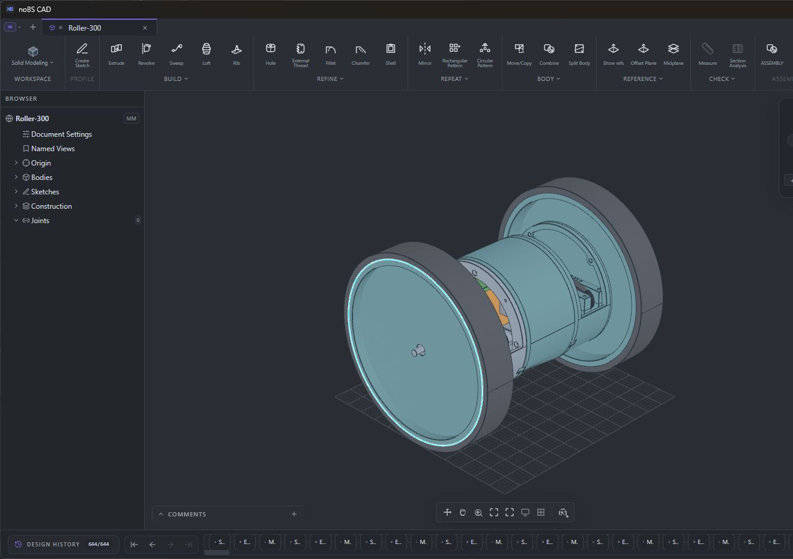
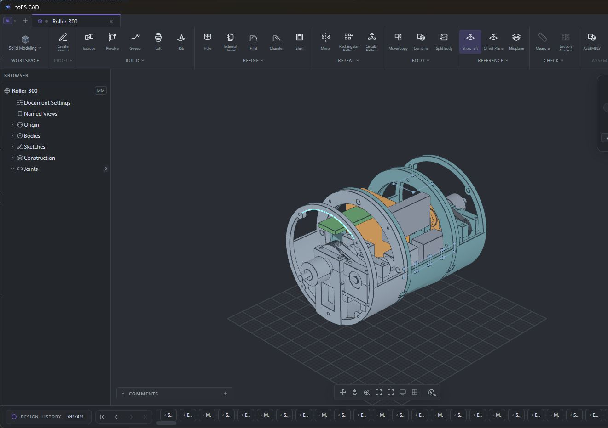

# Roller-300

Indoor-first, two-wheel differential-drive roller with a round rigid body. Mechanical prototype work in NoBS CAD; no caster. **Not physically validated or released for powered testing.**

Open **[Roller-300.nbcad](Roller-300.nbcad)** in NoBS CAD. This is the only active CAD source. It now contains both reusable drive ends, wheel envelopes, central tub/lid and component packaging, with 84 bodies and preserved native feature history. This is a full-vehicle packaging proposal, not a finished printable vehicle.

- [PLAN.md](PLAN.md): canonical mechanical decisions, open gates and adopted workflow.
- [parameters.json](parameters.json): targets and measurement record, manually synchronized with native geometry.
- [parts-sources.json](parts-sources.json) and [BOM.xlsx](BOM.xlsx): parts record and generated purchasing workbook.
- [test-record.json](test-record.json) and [drive-end-section-checks.json](drive-end-section-checks.json): actual checks and limits.
- `first-prints/drive-end-section/`: unpowered carrier/spine fit candidates, not a complete assembly release.
- `archive/`: superseded studies and retired generators. Do not use as parallel working sources.

Use component visibility and section views within the master; use rollback for history edits. Explicitly select export bodies. Do not create separate working CAD files merely to hide parts. Commit source and corresponding decisions together. After a native save, run `python tools/cad_snapshot.py --write`; the generated `checks/model-review.json` provides Git diffs and must never be hand-edited.

Current gates: servo ears/output and positive horn adapter, shaft retention, qualified clutch interfaces/duty, guarding and assembly access. Two simplified belt-envelope overlaps are not proof of tooth interference or correct meshing. Physical tests remain unperformed.

The `pre-consolidation-2026-09-19` tag preserves the imported design baseline. Generated scene dumps, runtime logs and slicer caches remain in the original local backup; they are not design sources. No hardware/source license is assigned by this initial publication; linked third-party material retains its own terms.

Offline fit slicing can be reproduced with `python tools/slice_fit.py carrier-end-section-fit` and `python tools/slice_fit.py input-spine-fit` on this Windows installation with Bambu Studio and the X2D profiles. This utility was restored from the archive for export verification; it does not create CAD geometry.

The preserved test article is in `first-prints/drive-end-section/`, pinned by its hash manifest and tag `drive-fit-candidate-2026-09-19` to source commit `80f06f3`. The advancing master does not silently redefine those exports. No print has been sent.
