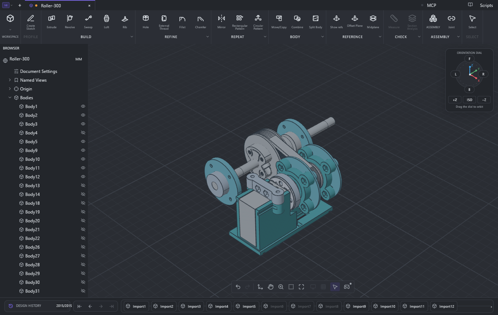
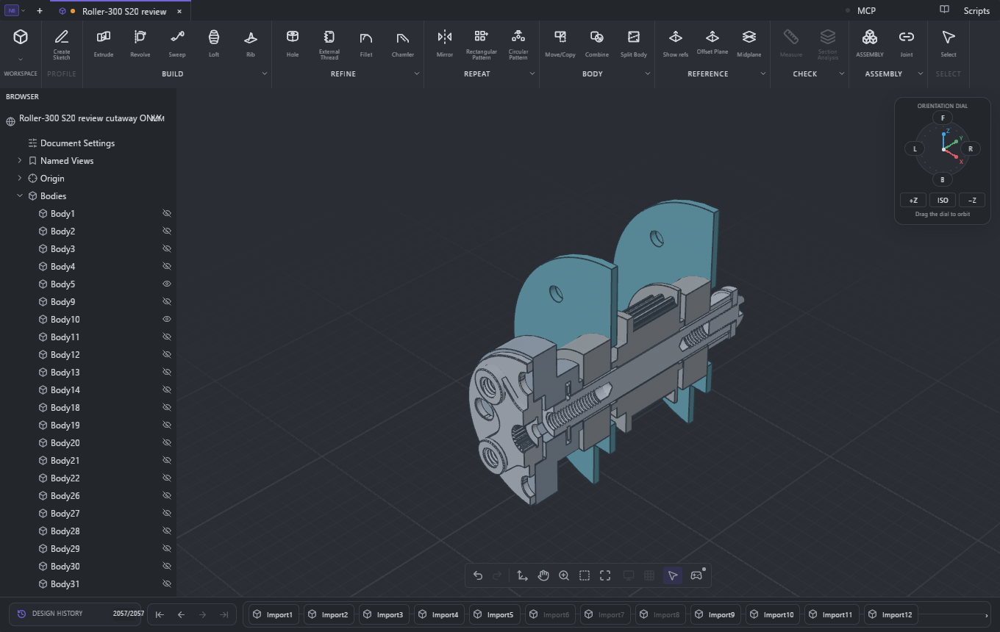
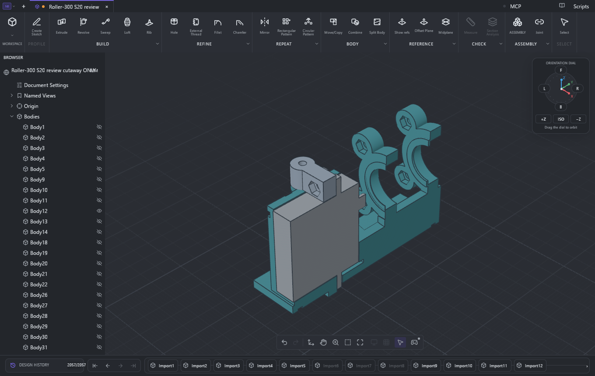

# S20 adversarial drivetrain review

Printing recommendation updated by the [fresh print decision](../print-decision-2026-10-06/README.md): start with the corrected five-part receiving-fit plate. The original ten-part review project is superseded by actual support/bed/settings findings. The geometry and nominal inspection evidence below remain applicable.

S20 corrects assembly defects in the prior nominal model and prepares an unpowered PETG one-drive fit article. [Current model](../../Roller-300.nbcad) and [assembly instructions](../../PLAN.md) are authoritative. No physical validation or powered release is claimed.

## Defects corrected

The earlier shared servo and bridge datums had moved repeatedly. The reference servo ears were12mm from their intended position, bridge bores missed the bridge, and restraints intersected the servo. Native overlap volumes included72.9mm³ with the roof-open fixture,307.8mm³ with its carrier and353.27mm³ with its bridge. Datums/reference ears are now coherent and stationary clearances pass at tested carrier travel.

The bridge lacked valid captures at its actual mounting points. S20 adds rounded posts, side-loaded bridge nuts, four captured ear nuts and lower driver passages. Nut seating, insertion and resistance to rotation are tested against the native solids. Loose nuts require a screw for captivity; a snap fit is not claimed.

The adapter's rotating pinch ear touched its carrier. The24T pulley's5mm clamp hub also could not enclose a conventional M3 nut. Both friction clamps are removed. A stock48mm REX shaft drives AF7.3 printed bores, with factory Eclip and stock rear retention. This simplifies assembly and avoids a fabricated thin collar and1.7mm shim stack.

A positive keyed bore needed a separate axial stop. Integral R5.5 pulley lands now locate it between bearing inner races, leaving0.4mm nominal total play. The shaft uses the Eclip pocket and rear metal stack for0.2mm nominal travel. Native probes verify permitted movement and interference beyond the stops. This establishes nominal geometry, not wear/load capacity.

The output8mm stop now uses stock6+2mm spacers. Right purchased threaded references use rotation, preserving right-hand thread geometry. Printed parts retain their intended mirror geometry.

## Native CAD images

All images are native application captures. [Review cutaway model](Roller-300-review-cutaway.nbcad) removes material only for inspection. **Do not print the cutaway.** The canonical model keeps intact parts. These sections show the left drive; subsequent correction of right stock-reference orientation did not change the pictured left geometry.

## Verification and limits

- [Validation summary](validation-summary.json):496 nominal checks,22 valid connected watertight print bodies,2,015 native features with0 errors, seven recalled Named Views preserving geometry.
- [Drivetrain geometry](checks.json):255 checks, including rotating clearances, travel, horn/hub screw positions and current axial dimensions.
- [Assembly probes](adversarial-checks.json):109 checks of actual stock REX/clip geometry, positive torque engagement, axial stops, nut loading/rotation and driver access on both drives.
- [Existing capture checks](capture-checks.json):122 checks of bearing retainers, carrier captures and trimmed envelope roots.
- [Wall sections](wall-section-checks.json):10 continuous-material gauges. Torque lands and horn rims are approximately1.285mm nominal minimum. One upper servo-nut pocket has a0.95mm local lip backed by4.2mm solid axial material; strength remains a physical qualification.
- [Left native interference](left-roof-open-native-interference.json) and [right native interference](right-full-frame-native-interference.json):27 selected bodies each. The only reported volume overlaps are the coarse belt envelope against its two pulleys and the nominal smooth servo spline against the actual25T horn spline. These references cannot qualify physical tooth/spline fit. Dense threaded REX/screw solids are excluded from this broad sweep and checked separately by the assembly probes. Thread fit and belt meshing remain receiving tests.
- Every native STL matches the current print manifest and slice-check hash. The final Bambu project's ten meshes are compared directly to current print STL triangle coordinates. All11 individual slices and the combined plate pass without warnings. Native preflight assembly-layout warnings are superseded by the separate verified print placements.

Actual PETG bearing/key/nut fit, factory Eclip installation, center-screw length, hardware seating, endplay and belt tracking must be recorded during unpowered assembly. Full-barrel rear screw service access remains obstructed by the upper guard and is deferred with barrel work. Powered shock, torque, heat and reversal loads are untested; the belt provides no calibrated torque limiting.
